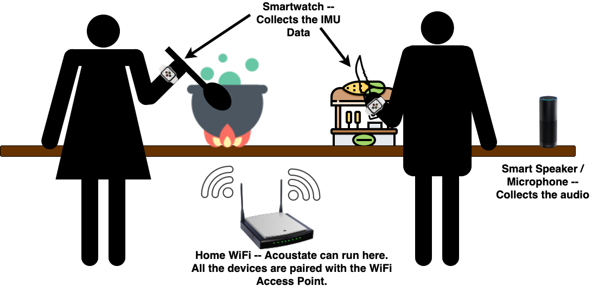
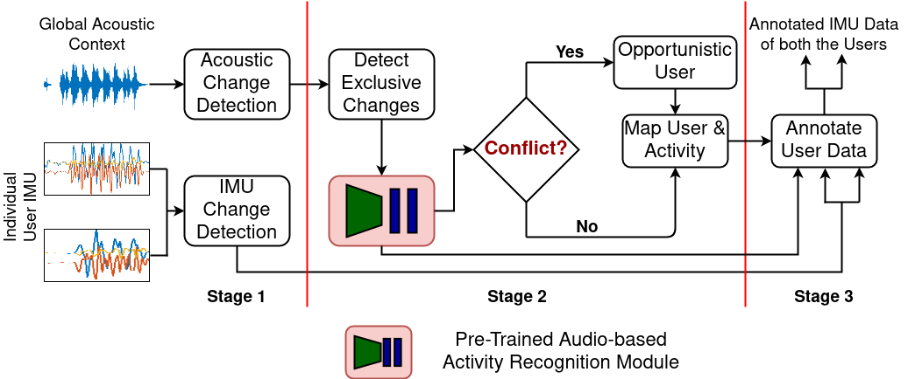

# Acconotate

This is public code repository for the paper **Acconotate: Exploiting Acoustic Changes for Automatic Annotation of Inertial Data at the Source**, accepted in **IEEE DCOSS-IoT 2023**. The presentation slides and teaser for the project are available: [here](https://docs.google.com/presentation/d/1UUBJHT5jJccThNckkkOYgTZKo4d11a3WikLp2Y09kzk/edit?usp=sharing) and [here](https://youtu.be/XAEgkozGecA).

<p align="center">
	
</p>

## Abstract

Smart infrastructures often intend to provide personalized context-aware services for their residents. These context-aware services, in turn, often rely on sophisticated machine learning algorithms which need vast volumes of costly annotated sensor data. State-of-the-art automated annotation frameworks try to solve this problem by generating annotated sensor data obtained from personal wearables. However, most of these approaches -- (a) either need visual data from the environment or (b) can only work for environments with a single resident. This paper discusses the design of a first-of-its-kind framework Acconotate which can automatically generate annotated data from dual resident smart environments without requiring any visual information. Acconotate achieves this by exploiting the typical transitions present in complex human activities first to solve the critical problem of the user-to-activity association and then use that to annotate the sensor stream available from both the users. Rigorous evaluation with two real-life datasets collected in two diverse scenarios shows that Acconotate can successfully generate annotated sensor data over the edge without human intervention.

## Running Acconotate

The expected input to the Acconotate framework is unlabelled raw triaxial accelerometer data from the smartwatch of the two users. The smartwatch needs to be worn on the preferred hand of the user with which they are performing the activities. Acconotate also needs the raw unlabelled audio data from the environment. Once this data is provided to Acconotate, it then (1) performs unsupervised change point detections independently over all these input data. Next, (2) it observes the acoustic gaps and finally (3) uses them to annotate the individual accelerometer data obtained from both the users. 

<p align="center">
	
</p>


### Software Requirements and Dependencies

To run and test Acconotate you would need MATLAB(R2017a) and `python` (3.9 or higher). The file `requirements.txt` provides the list of python dependencies required by this project. Additionally, Acconotate also utilizes a pre-trained audio-based activity recognition module for generating the annotations. This version of Acconotate currently uses the architecture and software pipeline defined in [Ubicoustics](https://github.com/FIGLAB/ubicoustics). Please refer to the original codebase of [Ubicoustics](https://github.com/FIGLAB/ubicoustics) for its license and software requirements.

### File Descriptions

- **Stage 1**

1. To detect changes in the individual IMU data from the two users, run `python3 check_imu_change.py`. This will generate two files (for each sensor file) within the dataset directory demarcating the change point scores and the corresponding actual changes obtained after clustering.

2. Similarly, to detect changes in the global audio, run `analysing_cpsd.m` in MATLAB. This will generate a folder named `cpsd_splits` within the dataset directory containing the individual audio splits along with an information file.

- **Stage 2**

1. Clone [Ubicoustics](https://github.com/FIGLAB/ubicoustics) repository and replace the two files from the `audio_model` folder in the cloned repository. Run `python3 run_predictions_audio` to generate predictions on the individual audio splits present in the `cpsd_splits` folder.

2. Run `python3 check_exclusive_changes.py` to recognise the acoustic gaps and identify the actvities of the users. This will generate a file `activity2user.csv` in the dataset folder where the activities mapped to the users will be logged. 

- **Stage 3**

1. Run `python3 annotate_users.py` to use the activity information to finally annotate their individual IMU streams.

### Sample Dataset and Results

The dataset directory `sample_dataset` contains the sample data for a workshop environment with two users hammering and cutting a wooden plank with a saw. For exact process of generating the dataset please refer to our poster paper accepted in ACM/IEEE IPSN 2022 [here](https://github.com/stilllearningsoumya/data_augmentation_strategy).

The dataset folder consists of the raw accelerometer data, in the files named `u*_ewatch.csv` from the smartwatch of the two users and the global audio file `global_audio.wav`. It also contains a log file containing the start and end timings of recording along with the individual ground-truth files (`u*_grnd_truth.csv`) for evaluation. 

The ground-truth files are not used as input to the Acconotate framework and are kept just for the purpose of assessment. The purpose of this example is to explain the working principle of Acconotate and not exact reproduction of results. Exact details of the dataset used, values of the random seed, virtual location of microphones, optimization settings, etc. may differ from the paper.

## Citations

If Acconotate, its findings or settings are helpful in your research, please consider citing our paper:

```
@inproceedings{acconotate,
  author={Chatterjee, Soumyajit and Singh, Arun and Mitra, Bivas and Chakraborty, Sandip},
  booktitle={2023 19th International Conference on Distributed Computing in Smart Systems and the Internet of Things (DCOSS-IoT)}, 
  title={Acconotate: Exploiting Acoustic Changes for Automatic Annotation of Inertial Data}, 
  year={2023},,
  pages={25-33},
  doi={10.1109/DCOSS-IoT58021.2023.00013}}
```

## Correspondence
Please contact [Soumyajit Chatterjee](mailto:sjituit@gmail.com) for further questions or clarifications.